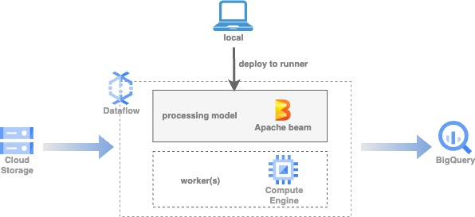
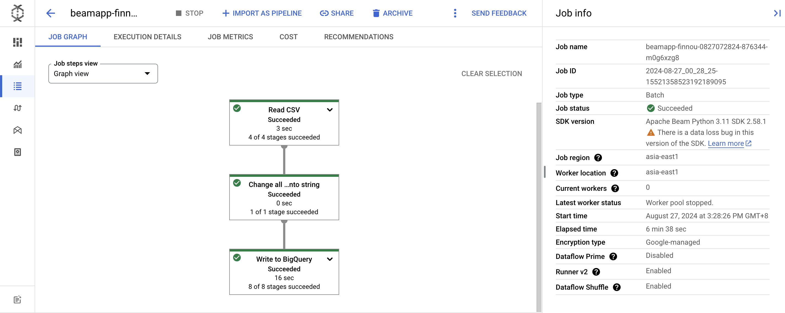
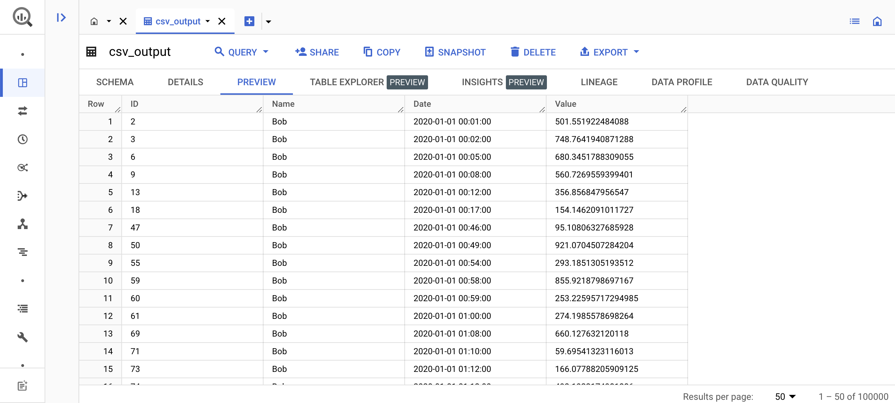

# Data ingestion by dataflow
Using Apache Beam to custom Dataflow ingestion service.

## Scenario
Ingesting files, changing all data types into string and writing into BigQuery.

## Architecture
### Simple Use Cases
Custom beam data pipeline without Dataflow template  


## Environment configuration
### 1. Install the Apache beam SDK
https://cloud.google.com/dataflow/docs/guides/installing-beam-sdk

### 2. Set up gcloud configurations on your terminal
```
# activate proper gcloud configuration to approach project 'tw-rd-de-data-solution'
gcloud config configurations activate <config_name>

# authenticate with the gcloud CLI
gcloud auth application-default login
```

## Roles and Permissions
1. Your user account
    - roles/iam.serviceAccountUser
2. Compute Engine default service account
    - roles/dataflow.admin
    - roles/dataflow.worker
    - roles/storage.objectAdmin
    - roles/artifactregistry.writer

## Related services
### Cloud Storage
Store Dataflow staging files and template files
- BUCKET NAME: `solution-data-ingestion-by-dataflow`

### Dataflow
Data pipeline jobs with parameters(pipeline options) and job information
- JOB NAME: beamapp-`<username>`-uuid()

### BigQuery
Destination table in BigQuery
- DATASET NAME: `solution_data_ingestion_by_dataflow`

## How to use
### 1. Environment variables
```
export PROJECT_ID=tw-rd-de-data-solution
export DATAFLOW_REGION=asia-east1
export BUCKET_NAME=solution-data-ingestion-by-dataflow
export DATASET_NAME=solution_data_ingestion_by_dataflow
```

### 2. Input files 
There are 3 types of supported input format: CSV, JSON(Newline), Parquet. 
List of mock data: 
- CSV: `gs://na_data_internal/sample_file/sample_data.csv`
- JSON(Newline): `gs://na_data_internal/sample_file/sample_data.txt` 
- Parquet: `gs://na_data_internal/sample_file/sample_data.parquet`


### 3. Simple Use Cases: Using command line
Parameters:
- project: Your project id 
- region: The region your pipeline service built in
- input: Your source file path
- output: BigQuery table name compiled with 'dataset.table' or 'project:dataset.table' pattern
- schema(optional): BigQuery table schema compiled with 'column1:datatype1,column2:datatyp2e' pattern
- runner: 'DataflowRunner' or 'DirectRunner' (more info: https://beam.apache.org/get-started/wordcount-example/#direct-runner)
- temp_location: Your data staging location as processing transformation

Sample command for CSV ingestion:
```
python pipeline.py \
    --project $PROJECT_ID \
    --region $DATAFLOW_REGION \
    --input gs://na_data_internal/sample_file/sample_data.csv \
    --output $DATASET_NAME.csv_output \
    --schema ID:STRING,Name:STRING,Date:STRING,Value:STRING \
    --runner DataflowRunner \
    --temp_location gs://$BUCKET_NAME/tmp/
```

## Output results
### Simple Use Cases 
1. Dataflow job detail

2. BigQuery data preview
