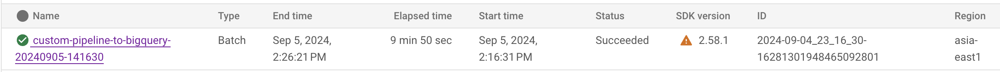
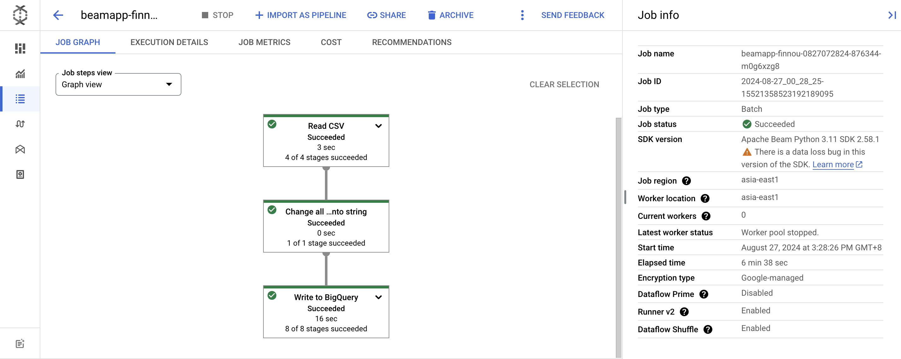
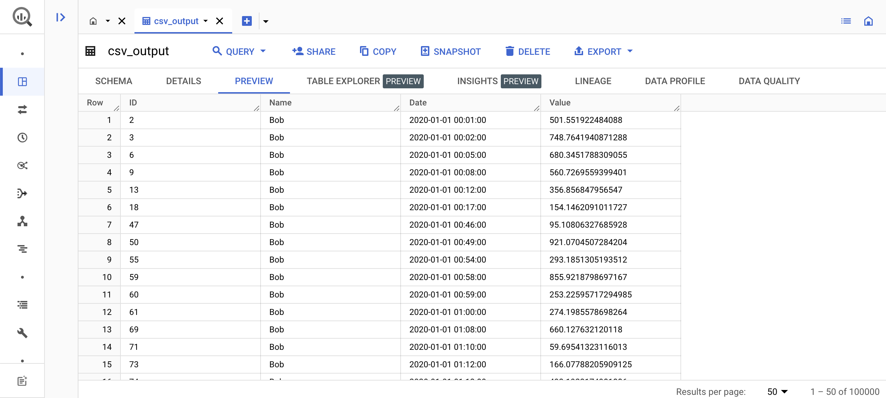

# Data ingestion by dataflow
Using Apache Beam to custom Dataflow ingestion service.

## Scenario
Ingesting files, changing all data types into string and writing into BigQuery.
1. [A simple use case](/without_template_pipeline/) with direct deployment: running Apache beam data pipeline without templates
2. [A complete use case](/custom_template_pipeline_csv/) with custom template deployment: running Apache beam data pipeline with custom flex templates


## Environment configuration
### 1. Install the Apache beam SDK
https://cloud.google.com/dataflow/docs/guides/installing-beam-sdk

### 2. Set up gcloud configurations on your terminal
```
# activate proper gcloud configuration to approach project 'tw-rd-de-data-solution'
gcloud config configurations activate <config_name>

# authenticate with the gcloud CLI
gcloud auth application-default login
```

## Roles and Permissions
1. Your user account
    - roles/iam.serviceAccountUser
2. Compute Engine default service account
    - roles/dataflow.admin
    - roles/dataflow.worker
    - roles/storage.objectAdmin
    - roles/artifactregistry.writer


## Output results
1. Dataflow job and detail


2. BigQuery data preview
